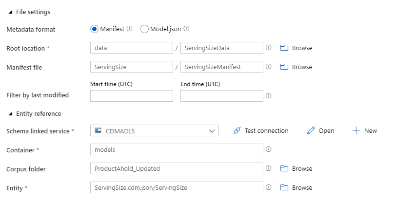
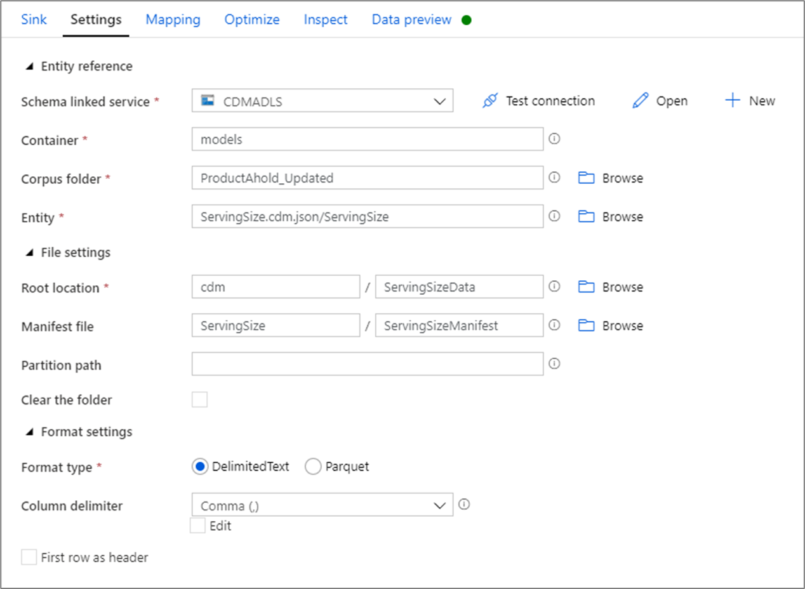

# Common Data Model format in Azure Data Factory
[!INCLUDE[appliesto-adf-asa-md](includes/appliesto-adf-asa-md.md)]

The Common Data Model (CDM) metadata system makes it possible for data and its meaning to be easily shared across applications and business processes. To learn more, see the [Common Data Model](https://docs.microsoft.com/common-data-model/) overview.

In Azure Data Factory, users can transform to and from CDM entities stored in [Azure Data Lake Store Gen2](connector-azure-data-lake-storage.md) (ADLS Gen2) using mapping data flows.

> [!NOTE]
> Common Data Model (CDM) format connector for ADF data flows is currently available as a public preview.

## Mapping data flow properties

The Common Data Model is available as an [inline dataset](data-flow-source.md#inline-datasets) in mapping data flows as both a source and a sink.

### Source properties

The below table lists the properties supported by a CDM source.

| Name | Description | Required | Allowed values | Data flow script property |
| ---- | ----------- | -------- | -------------- | ---------------- |
| Format | The is always `cdm` | yes | `cdm` | format |
| Metadata format | Where the entity reference to the data is located. If using CDM version 1.0, choose manifest. If using a CDM version before 1.0, choose model.json. | Yes | `'manifest'` or `'model'` | manifestType |
| Root location: container | Container name of the CDM folder | yes | String | fileSystem |
| Root location: folder path | Root folder location of CDM folder | yes | String | folderPath |
| Manifest file: Entity path | Folder path of the entity within the root folder | no | String | entityPath |
| Manifest file: Manifest name | Name of the manifest file  | yes, if using manifest | String | manifestName |
| Filter by last modified | Choose to filter files based upon when they were last altered | no | Timestamp | modifiedAfter   modifiedBefore | 
| Schema linked service | The linked service where the corpus is located | yes, if using manifest | `'adlsgen2'` or `'github'` | corpusStore | 
| Entity reference container | Container corpus is in | yes, if using manifest and corpus in ADLS Gen2 | String | adlsgen2_fileSystem |
| Entity reference Repository | GitHub repository name | yes, if using manifest and corpus in GitHub | String | github_repository |
| Entity reference Branch | GitHub repository branch | yes, if using manifest and corpus in GitHub | String |  github_branch |
| Corpus folder | the root location of the corpus | yes, if using manifest | String | corpusPath |
| Corpus entity | Path to entity reference | yes | String | entity |
| Allow no files found | If true, an error is not thrown if no files are found | no | `true` or `false` | ignoreNoFilesFound |

### Sink properties

The below table lists the properties supported by a CDM sink.

| Name | Description | Required | Allowed values | Data flow script property |
| ---- | ----------- | -------- | -------------- | ---------------- |
| Format | The is always `cdm` | yes | `cdm` | format |
| Root location: container | Container name of the CDM folder | yes | String | fileSystem |
| Root location: folder path | Root folder location of CDM folder | yes | String | folderPath |
| Manifest file: Entity path | Folder path of the entity within the root folder | no | String | entityPath |
| Manifest file: Manifest name | Name of the manifest file  | yes | String | manifestName |
| Schema linked service | The linked service where the corpus is located | yes | `'adlsgen2'` or `'github'` | corpusStore | 
| Entity reference container | Container corpus is in | yes, if corpus in ADLS Gen2 | String | adlsgen2_fileSystem |
| Entity reference Repository | GitHub repository name | yes, if corpus in GitHub | String | github_repository |
| Entity reference Branch | GitHub repository branch | yes, if corpus in GitHub | String |  github_branch |
| Corpus folder | the root location of the corpus | yes | String | corpusPath |
| Corpus entity | Path to entity reference | yes | String | entity |
| Partition path | Location where the partition will be written | no | String | partitionPath |
| Clear the folder | If the destination folder is cleared prior to write | no | `true` or `false` | truncate |
| Format type | Choose to specify parquet format | no | `parquet` if specified | subformat |
| Column delimiter | If writing to DelimitedText, how to delimit columns | yes, if writing to DelimitedText | String | columnDelimiter |
| First row as header | If using DelimitedText, whether the column names are added as a header | no | `true` or `false` | columnNamesAsHeader |

## Next steps

Create a [source transformation](data-flow-source.md) in mapping data flow.
